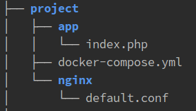

### [1. HTTP](#markdown-header-1-http)

1. Basic-авторизация. Для успешной авторизации на ресурсе `postman-echo.com` необходимо выполнить `GET`-запрос
с токеном `cG9zdG1hbjpwYXNzd29yZA==` на `endpoint`: `/basic-auth`.
Заголовок `Authorization` имеет вид:
````rest
Authorization: Basic <token>
````
Необходимо выполнить задачу, используя инструменты:

- [Telnet](https://losst.ru/kak-polzovatsya-telnet)
- [Curl](http://rus-linux.net/lib.php?name=/MyLDP/internet/curlrus.html)
- [Jet Brains HTTP client](https://www.jetbrains.com/help/idea/http-client-in-product-code-editor.html)
 
> Результатом выполнения задания является наличие трех файлов с командами в директории `http`: `telnet.sh`, `curl.sh`, `client.http`.

> Поводом перехода к следующему заданию является факт принятия текущего задания, оформленного в виде `Pull Request`'а.

### [2. SSH](#markdown-header-2-ssh)

1. [Установить](https://help.ubuntu.ru/wiki/%D1%80%D1%83%D0%BA%D0%BE%D0%B2%D0%BE%D0%B4%D1%81%D1%82%D0%B2%D0%BE_%D0%BF%D0%BE_ubuntu_server/%D1%83%D0%B4%D0%B0%D0%BB%D0%B5%D0%BD%D0%BD%D0%BE%D0%B5_%D0%B0%D0%B4%D0%BC%D0%B8%D0%BD%D0%B8%D1%81%D1%82%D1%80%D0%B8%D1%80%D0%BE%D0%B2%D0%B0%D0%BD%D0%B8%D0%B5/openssh_server) (если не установлен) на локальную машину `openssh` - сервер.
2. Подключиться к `ssh-серверу` по паролю.
3. Изменить порт для подключения в конфигурации `ssh-сервера` и подключиться к нему, используя новый порт.
4. Создать локальный `ssh-ключ`.
5. Реализовать авторизацию на сервере с помощью публичного ключа, после чего заново подключиться к серверу без использования пароля.

> Результатом выполнения задания является наличие следующих файлов в директории `ssh`:
> - `commands.sh`. В нем необходимо расположить все команды, введенные в терминале при выполнении задания;  
> - `sshd_config`. Это конфигурационный файл `ssh-сервера`, расположенный по пути `/etc/ssh/sshd_config`;
> - `authorized_key`. Расположение: `~/.ssh/authorized_key`.

> Поводом перехода к следующему заданию является факт принятия текущего задания, оформленного в виде `Pull Request`'а.


### [3. GIT](#markdown-header-3-git)

1. Создать в `https://bitbucket.org/` новый репозиторий.
2. [Добавить новый удаленный репозиторий](https://git-scm.com/docs/git-remote) с названием `another-origin`.
Взаимодействие с удаленным репозиторием должно быть осуществлено через `ssh` (используя публичный ключ). 
3. Отправить в репозиторий `another-origin` текущее состояние ветки `master`.
4. Создать 2 ветки из ветки `master`: `3-git-first` и `3-git-second`.
5. Переключиться на ветку `3-git-first` и изменить значение переменной `$string` в файле `git/conflict.php` на `first`.
6. Выполнить `git merge` ветки `3-git-first` в `master`.
7. Переключиться на ветку `3-git-second` и изменить значение переменной `$string` в файле `git/conflict.php` на `second`.
8. Попытаться выполнить `git merge` ветки `3-git-second` в `master`.
9. Разрешить конфликты и вылить изменения в отдельную ветку репозитория `origin`.
10. Создать `Pull Request`.

> Результатом выполнения задания является наличие `Pull Request`'а со всей историей коммитов.

> Поводом перехода к следующему заданию является факт принятия текущего задания, оформленного в виде `Pull Request`'а.

### [4. Docker](#markdown-header-4-docker)

_4.1. Подготовка окружения_

1. В директории `project` необходимо разместить файл `docker-compose.yml` и декларировать 2 сервиса:
- web. За основу взять образ `nginx:stable`. Сервис должен слушать порт `8080`;
- php. За основу взять образ `php:7-fpm`.
2. В директории `project/web` разместить конфигурацию `nginx`: `default.conf`.

В итоге должна получиться структура вида:



Необходмо добиться того, чтобы при переходе по ссылке http://localhost:8080/ выводилась информация об установленной версии `php`.

> Результатом выполнения задания является наличие `Pull Request`'а с выполненным заданием.

> Поводом перехода к следующему заданию является факт принятия текущего задания, оформленного в виде `Pull Request`'а.

_4.2. Установка и настройка `Xdebug`_

1. В директории `project/app` создать файл `Dockerfile`, в котором описать установку php-расширения `xdebug`.
2. В файле `docker-compose.yml` заменить `image` на `build` у сервиса `php`.
3. Настроить в `PhpStorm`'е соответствия директорий хостовой машины и контейнера и убедиться, что отладка кода работает корректно:
````php
File | Settings | Languages & Frameworks | PHP | Servers
```` 

> Результатом выполнения задания является наличие `Pull Request`'а с выполненным заданием.

> Поводом перехода к следующему заданию является факт принятия текущего задания, оформленного в виде `Pull Request`'а.

_4.3. Установка и настройка `Composer`_

1. Добавить в `project/app/Dockerfile` установку `composer` глобально.
2. В контейнере `php` выполнить инициализацию `composer`. В результате в директории `project/app` должен появиться файл `composer.json`.

> Результатом выполнения задания является наличие `Pull Request`'а с выполненным заданием.

> Поводом перехода к следующему заданию является факт принятия текущего задания, оформленного в виде `Pull Request`'а.

### [5. Программирование](#markdown-header-5)

_5.1. Обработка запросов. Реализация собственного контроллера_

- В файле `project/app/routes.php` находится конфигурация `endpoint`'ов.
- В папке `project/app/Controllers` находятся контроллеры, которые должны обрабатывать запросы.
Необходимо написать функционал, который по заданной конфигурации (п.1) будет обрабатывать запросы и возвращать корректные ответы (п.2)

> Результатом выполнения задания является наличие `Pull Request`'а с выполненным заданием.

> Поводом перехода к следующему заданию является факт принятия текущего задания, оформленного в виде `Pull Request`'а.


_5.2. Обработка запросов. Использование готового решения на основе [`Slim Framework`](http://www.slimframework.com/)_

1. Установить `Slim Framework` через `Composer`.
2. Подключить автозагрузчик классов. 
3. Реализовать функционал, выполненный в задании 5.1 с помощью фреймворка.
4. Выполнить рефакторинг `endpoint`'а `/api/v1/auth`.
Необходимо возвращать ответ `200` только в случае корректной передачи заголовка `Authorization` из задачи 1.1.
Логику проверки токена реализовать в `Middleware`'е.
5. Добавить `endpoint`'а `/api/v1/postman/auth`.
При обработке запроса необходимо выполнить запрос к внешнему сервису `http://postman-echo.com/basic-auth`.
Для реализации запросов использовать библиотеку `Guzzle`, которую необходимо предварительно установить через `composer`.
Необходимо возвращать тот же статус ответа, какой его возвращает сервис `postman-echo.com`. Тело ответа должно быть реализовано самостоятельно. 

> Результатом выполнения задания является наличие `Pull Request`'а с выполненным заданием.

> Поводом перехода к следующему заданию является факт принятия текущего задания, оформленного в виде `Pull Request`'а.

_5.3. Dependency Injection. Реализация собственного DI-контейнера._

1. Необходимо реализовать функционал, позволяющий "собирать" объекты "на ходу", проверяя и передавая зависимости в виде объектов, если таковые имеются.
При запуске кода:
````php
$container = new MyDIContainer();
$userManager = $container->get('UserManager');
````
В конечном результате должет создаться объект `UserManager`
Класс `MyDIContainer` находится в директории `Components`.

2. В случае, если функционал не может проинициировать необходимую зависимость (несколько имплементаций одного интерфейса), необходимо задавать зависимости вручную.
Для этого необходимо задать настройки в файле `project/app/di-config.php`. Формат массива произвольный.

> Результатом выполнения задания является наличие `Pull Request`'а с выполненным заданием.

> Поводом перехода к следующему заданию является факт принятия текущего задания, оформленного в виде `Pull Request`'а.

_5.4. Dependency Injection. Использование готового DI-контейнера [`PHP-DI`](http://php-di.org/)._

1. Установить библиотеку с помощью `composer`.
2. Повторить пункты из предыдущего задания, используя установленную библиотеку.

> Результатом выполнения задания является наличие `Pull Request`'а с выполненным заданием.

> Поводом перехода к следующему заданию является факт принятия текущего задания, оформленного в виде `Pull Request`'а.

_5.5. S.O.L.I.D_

1. Проанализировать код в директории `project/app/Components/GeoLocation`.
2. Если было замечено нарушение одного / нескольких принципов `S.O.L.I.D`, необходимо произвести рефакторинг.
3. В описании `Pull Request`'а написать, какие принципы были нарушены.


### [6. Работа с БД](#markdown-header-6)

_6.1. Установка `Eloquent` и создание модели пользователя_

1. Добавить в `docker-compose.yml` сервис с базой данных. За основу взять образ `postgres`.
2. Установить [`laravel eloquent`](https://medium.com/@kshitij206/use-eloquent-without-laravel-7e1c73d79977) с помощью `composer`.
3. Реализовать модель `project/app/Models/User.php`, создать и применить миграции БД.
4. Реализовать модели `Role`, `UserRole`. Отношение один-ко-многим (один пользователь - несколько ролей).

_6.2. Регистрация / авторизация пользователя с помощью [`JWT`](https://ru.wikipedia.org/wiki/JSON_Web_Token)_

1. Реализовать роут для регистрации пользователя: `/api/v1/register`.
2. Зарегистрировать пользователя и присвоить ему роль "Администратор".
3. Установить библиотеку `firebase/php-jwt`.
4. Реализовать `endpoint` `/api/v1/auth`.
В результате успешной авторизации в теле ответа необходимо возвращать `JWT`-токен, сгенерированный библиотекой `php-jwt`.
5. Реализовать `Middleware` для остальных `endpoint`'ов, проверяющий наличие в заголовке, а также валидность токена.
В случае некорректности запроса возвращать `401 Unauthorized`.
